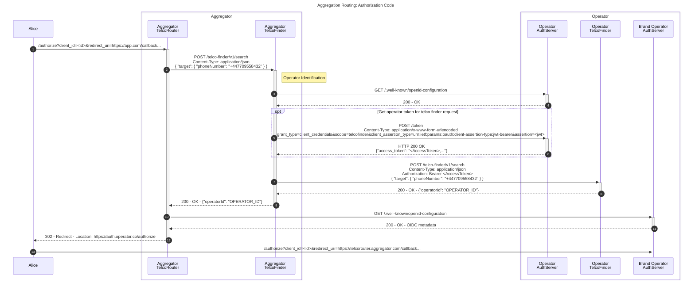
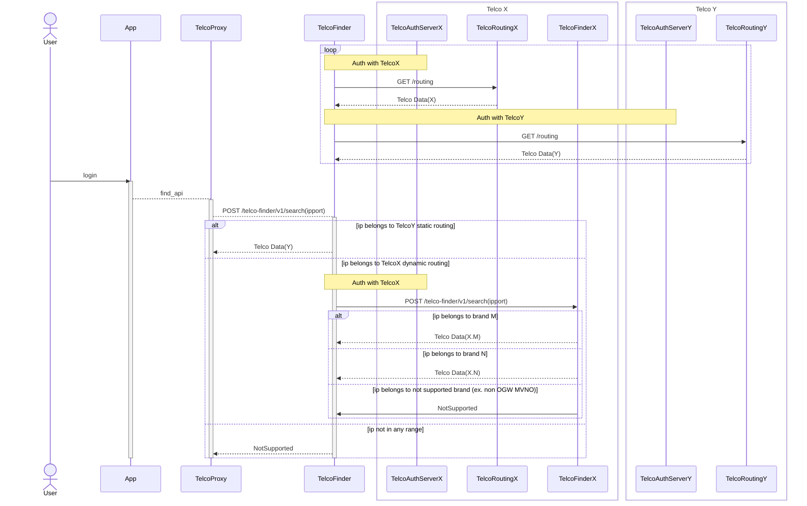
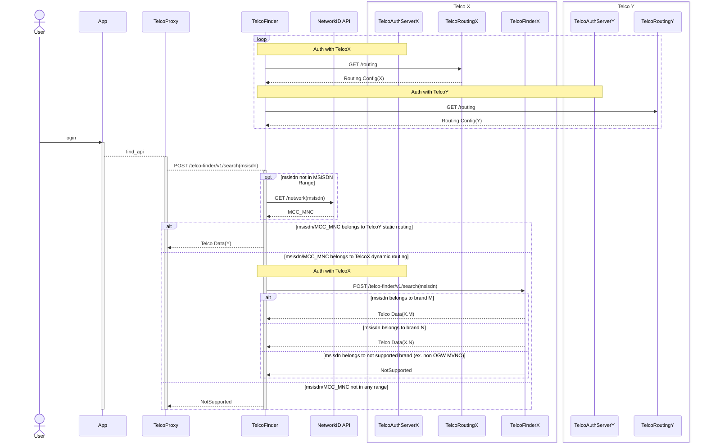

# Routing / Telco Finder

Section to describe the Telco Finder service and how routing is achieved.

| Owners                    | Reviewers    |
|---------------------------|--------------| 
| Juan Cáceres (Telefónica) | Mark Cornall |

## Telco Finder Service

Telco Finder is an integral component of the Open Gateway architecture designed to provide information about the operator associated with a user, as well as the relevant endpoints required for performing operations related to that operator.

Telco Finder has two main functions:
1.	Resolution of User identifier to Operator identifier:The primary function of Telco Finder is to map a user identifier to the corresponding operator identifier. This process is managed by an internal Resolution component that queries both internal and external lookup data to achieve the mapping.
  
2.	Retrieval of Operator data and endpoints: Upon obtaining the operator identifier, Telco Finder retrieves the associated data and the endpoints exposed by that operator. This can be achieved in two ways:
	*	Internal Storage: Telco Finder may store the necessary information and provide it directly.
	*	Delegation: Telco Finder can delegate the retrieval of information to another Telco Finder, which will return the required data. This approach is particularly beneficial in multi-brand scenarios.

## Telco Finder Interface

Telco Finder is exposed as a RESTful API in OAS format – the specification can be found [here](../code/API_definitions/telco-finder.yaml). The specification contains detailed usage information.

It provides a `POST /search` endpoint to retrieve information about the operator associated with a given user identifier. At a fundamental level, it accepts a user identifier as an input and responds with an operatorId. Optionally, based on input control flags, it also returns the operator's API root URL and the operator's authorization server discovery endpoint.

For use in regions with mobile number portability, the interface also provides an input parameter that controls the internal search mode of Telco Finder. This `portabilitySearchMode` input parameter provides 2 options: `SHALLOW` and `DEEP`. The shallow option directs Telco Finder to search only its internal records (e.g. cache). This method can be preferred to avoid higher monetary costs associated with extended searches. The full search triggers a comprehensive search against all external systems, providing more thorough results at a potentially higher cost and ensuring up-to-date information by bypassing stale cached data. 

### Examples

Example A. Request - searching for a telephone number - using only mandatory input fields:
```
POST /telco-finder/v1/search HTTP/1.1
HOST: api.operator.com
Content-Type: application/json

{
  "target": {
    "phoneNumber": "+447709558432"
  }
}
```
Response for Example A:
```
HTTP/1.1 200 OK
Content-Type: application/json

{
  "operatorId": "OPERATOR_ID"
}
```

Example B. Request - searching for an IP address -  using optional boolean input fields to control response granularity. These booleans direct the Telco Finder to also return the operator's API root URL and the operator's authorization server discovery endpoint.

```
POST /telco-finder/v1/search HTTP/1.1
HOST: api.operator.com
Content-Type: application/json

{
  "target": {
    "ipv4Address": {
      "publicAddress": "84.125.93.10",
      "publicPort": 59765
    }
  },
  "includeApiRoot": true,
  "includeAuthProviderConfiguration": true
}
```

Response for Example B:

```
HTTP/1.1 200 OK
Content-Type: application/json

{
  "operatorId": "OPERATOR_ID",
  "apiRoot": "https://example.operator.com",
  "authProviderConfiguration": "https://auth.operator.com/.well-known/openid-configuration"
}
```

Example C. Request - searching for a phone number and specifying a portability search mode

```
POST /telco-finder/v1/search HTTP/1.1
HOST: api.operator.com
Content-Type: application/json

{
  "target": {
    "phoneNumber": "+447709558432"
  },
  "portabilitySearchMode": "SHALLOW"
}
```

Response for Example C:

```
HTTP/1.1 200 OK
Content-Type: application/json

{
  "operatorId": "OPERATOR_ID",
}
```

Example D. Request - searching for a phone number and using all possible input parameters

```
POST /telco-finder/v1/search HTTP/1.1
HOST: api.operator.com
Content-Type: application/json

{
  "target": {
    "phoneNumber": "+447709558432"
  },
  "includeApiRoot": true,
  "includeAuthProviderConfiguration": true
  "portabilitySearchMode": "SHALLOW"
}
```

Response for Example D:

```
HTTP/1.1 200 OK
Content-Type: application/json

{
  "operatorId": "OPERATOR_ID",
  "apiRoot": "https://example.operator.com",
  "authProviderConfiguration": "https://auth.operator.com/.well-known/openid-configuration"
}
```
### Sequence diagram
In the diagram below, it is shown how the component delegates the obtaining of information related to the user from another Telco Finder in a multi-brand scenario. 
Because the exchanged information contains user personal data, this request to a public endpoint should be secured by a `client credentials` flow of [OAuth 2.0](https://datatracker.ietf.org/doc/html/rfc6749).


# Operator Resolution

Identifying the owning Operator Platform for any subscriber and device is performed through a routing mechanism: 
* Each operator provides the Telco Finder a [Telco Routing API](#telco-routing-api) end-point which facilitates a routing table. 
* Per country, the Telco Finder aggretages the operator routing tables to resolve user identifiers into the operator brand and API end-points. 

A routing rule is composed by a condition and a resolution action. The condition defined on a id ranges bases and is met if the user identifier belongs to one of them:
  
  * **IP Ranges** represented in the CIDR notation as defined in [RFC 4632](https://datatracker.ietf.org/doc/html/rfc4632). For example, `80.23.124.200/22` for IPv4 or `ffff:0:0:89fa:cdea:2341:2ds1f:ffff/20` for IPv6. 
  * **MSISDN prefixes**, for countries without phone number portability. For example `+100234`.
  * **Network identifier**: MCC and MNC components of the IMSI as defined in [TS 23.003](https://portal.3gpp.org/desktopmodules/Specifications/SpecificationDetails.aspx?specificationId=729), for countries with phone number portability. For example, `22401`. An `msisdn` is resolved into the owning network by the Telco Finder using per-country specific [Network Id API](#network-id-api).

  IMSI (International Mobile Subscription Identity) structure:


  | MCC | MNC | MSIN |
  | :---: | :---: | :---: | 
  | 3 digits | 2 or 3 digits |  up to 9 or 10 digits (max IMSI length 15 digits) |
  | Mobile Country Code | Mobile Network Code |  Mobile Subscriber Identification Number |


There are two types of routing resolution actions:

* **Static Routing**: The routing rule maps directly user identifiers onto end-point urls. This is the simplest case, where all user identifiers in a range belongs to the same brand and are served by the same end-point.
* **Dynamic Routing**: When an user identifyer range is shared among different brands and each brand exposes its own API end-points. The routing rule maps the user identifier range onto a second-level Telco Finder interface, provided by the Telco Operator, which will be called by the Telco Finder to resolve the user identifyer.

Next figure shows an overview of Telco Finder routing architecture:

* Each Telco Operator which has signed an agreement with the Aggregator provides a **Telco Routing API** to the Telco Finder.
* If a Telco Operator provides a dynamic routing rule, it has to provide at least one  **Telco Finder interface** end-point for user identifiers resolution.
* If a Telco Operator uses network MCC_MNC values at routing rules, the Telco Finder is required to use a [Network Id API](#network-id-api) to map MSISDN onto the owning MCC_MNC network.


## API End-points

Two-legged `client credentials` flow of [OAuth 2.0](https://datatracker.ietf.org/doc/html/rfc6749) shall be used to authenticate the Telco Finder accessing the **Telco Routing**, **Network Id** and **Telco Finder** APIs. The client authentication method for both **Telco Routing** and **Telco Finder** is based on ```private_key_jwt```, as defined in [OIDC Client Authentication](https://openid.net/specs/openid-connect-core-1_0.html#ClientAuthentication).

Following [CAMARA API Design Guidelines](https://github.com/camaraproject/Commonalities/blob/main/documentation/API-design-guidelines.md#5-versioning), the APIs shall be called following next API versioning schema:

```https://host:port/<api>/<version>/<resource>```

For example:

* Telco Finder: ```https://apis.router.com/telco-finder/v1/search```
* Telco Routing: ```https://apis.telco.com/telco-routing/v1/routing```
* Network Id: ```https://apis.network.com/network-id/v0/resolve-network-id```

## Telco Routing API

The **Telco Routing API** provides an end-point to get the Routing Table from a Telco Operator. The Telco Finder aggregates the routing rules provided by each partner operator and tries to resolve request.

### GET Routing Table Operation

This operation return a JSON array of Objects which represents routing rules as defined in [Routing Rule Format](#routing-rule-format).

An example of API call may be:

```
GET /routing HTTP/1.1
Host: apis.operator.com
Accept: application/json
```

and the return:

```
HTTP/1.1 200 OK
Content-Type: application/json

[
    {
        "ipv4": ["23.124.1.200/20", "34.231.2.120/22"],
        "ipv6": ["ff22:0:0:ab:23:1a:346:7332/64"],
        "static": {
            "operatorId": "OPERATOR_ID",
            "authProviderConfiguration": "https://auth.operator.com/.well-known/openid-configuration",
            "apiRoot": "https://example.operator.com"
        }
    },
    {
        "network": ["23405", "23413"],
        "dynamic": {
            "authProviderConfiguration": "https://auth.operator.com/.well-known/openid-configuration",
            "telcoFinder": "https://apis.operator.com/telco-finder/v1"            
        }
    }
]

```
## Routing Rule Format

Each routing rule is represented by a JSON Object with next members:

* `ipv4`: array of strings in CIDR notation. List of IP V4 ranges (example: `23.124.1.200/20`).
* `ipv6`: array of strings in CIDR notation. List of IP V6 ranges (example: `ff22:0:0:ab:23:1a:346:7332/64`).
* `msisdnPrefix`: array of strings representing a msisdn prefix stating by the country code (example: `+100234`)
* `network`: array of strings representing a MCC_MNC code (example: `23401`)
* `static`: JSON Object representing an static routing rule which is equivalent to the Telco Finder result components:

    * `operatorId` (mandatory) which represents operator brand of the end-user
    * `apiRoot`  (mandatory): the root URL of the API Gateway managed by the operator.
    * `authProviderConfiguration`: the discovery endpoint of the operator's authorization server. This is a standardized URL in [OpenID Connect](https://openid.net/specs/openid-connect-discovery-1_0.html#ProviderMetadata) and [OAuth 2.0](https://datatracker.ietf.org/doc/html/rfc8414#section-3) that allows clients to dynamically retrieve configuration metadata about the authorization server.


* `dynamic`: JSON Object representing the reference to a second level Telco Finder end-point to resolve multi-brand routing:

    * `authProviderConfiguration`: the discovery endpoint of the operator's authorization server. This is a standardized URL in [OpenID Connect](https://openid.net/specs/openid-connect-discovery-1_0.html#ProviderMetadata) and [OAuth 2.0](https://datatracker.ietf.org/doc/html/rfc8414#section-3) that allows clients to dynamically retrieve configuration metadata about the authorization server.
    * `telcoFinder`: URL of the second level Telco Finder

Each Telco Routing Rule, at least, must have any of `ipv4`, `ipv6`, `msisdnPrefix` or `network` member and one of `static` or `dynamic` member. 

An example of static routing rule is:


```
  {
    "ipv4": [
      "23.124.1.200/20",
      "34.231.2.120/22"
    ],
    "ipv6": [
      "ff22:0:0:ab:23:1a:346:7332/64"
    ],
    "network": [
      "23405",
      "23411"
    ],
    "static": {
      "operatorId": "OPERATOR_ID",
      "authProviderConfiguration": "https://auth.operator.com/.well-known/openid-configuration",
      "apiRoot": "https://example.operator.com"
    }
  }
```

An example of dynamic routing rule is:

```
  {
    "network": ["23405","23411"],
    "dynamic": {
      "authProviderConfiguration": "https://auth.operator.com/.well-known/openid-configuration",
      "telcoFinder": "https://apis.operator.com/telco-finder/v1"
    }
  }
```

An example of dynamic routing rule with MSISDN prefiexes:

```
  {
    "msisdnPrefix": ["+100234", "+100333"],
    "dynamic": {
      "authProviderConfiguration": "https://auth.operator.com/.well-known/openid-configuration",
      "telcoFinder": "https://apis.operator.com/telco-finder/v1"
    }
  }
```
## IP address lookup

For IP routing, the routing rule conditions are define as `ipv4` and `ipv6` vectors of ranges. 

Next sequence diagram shows how the end-user ip-port identity is resolved into the proper operator and API link:



1.	Periodically (x minutes), TelcoFinder request to each Operator the routing configuration

2.	Each time a user logs in an Application, the Application request the TelcoProxy the API end-points for that user (identified by the calling ip-port of the Device where the App is running; this is observed by Telco Proxy)

3.	The TelcoFinder looks for the IP Address Range of the device and determines:

    1.	The IP address belongs to the TelcoY static routing dataset (determined from the Routing Config sourced from TelcoY). Then returns to TelcoProxy the TelcoY data (operatorId and potentially apiRoot/authProviderConfiguration based on input request).
  
    2.	The IP address belongs to TelcoX dynamic routing dataset (determined from the Routing Config sourced from TelcoX). The TelcoFinder then needs to call TelcoX's second-level TelcoFinder to resolve the ip-port (the URL of the TelcoX's TelcoFinder was part of the Routing Config polled from TelcoX). The TelcoFinderX of TelcoX may return:

        - If ip-port belongs to one of the TelcoX brands, returns the brand data (operatorId and potentially apiRoot/authProviderConfiguration based on input request)

        - If ip-port belongs to a brand which does not support CAMARA APIs returns a NotSupported error.

    3.	The IP address does not belong to any of the registered telcos and returns a Notsupported error.


## MSISDN lookup 

For MSISDN routing, the routing rule conditions are define with:

* `msisdnPrefix` members for countries without number portability. For example:

* `network` members with a list of MCC_MNC identifiers, for countries with number portability. 

Next sequence diagram shows how the end-user msisdn identity is resolved into the proper operator and API link:



1.	Periodically (x minutes), TelcoFinder request to each Operator the routing configuration
2.	Each time a user logs in an Application, the Application request the TelcoProxy the API end-points for that user (identified by its msisdn)
3.	The Telco Finder looks at the routing table for the Telco routing data based on:
    
    1.	The msisdn ha a MSISDN prefix; if not,
    
    2.	The TelcoFinder request the NetworkId API the MCC_MNC of the network belonging the msisdn, and this network id belongs to a MCC_MNC range.

    3.	No routing record is found, and then returns a Notsupported error to the Telco Proxy.

4.	The TelcoFinder gets the resolved routing data:

    1.	If msisdn or MCC_MNC belongs to the TelcoY static routing dataset (determined from the Routing Config sourced from TelcoY). Then returns to TelcoProxy the TelcoY data (operatorId and potentially apiRoot/authProviderConfiguration based on input request).

    2.	If msisdn or  MCC_MNC belongs to the TelcoX dynamic routing dataset. TelcoX dynamic routing dataset (determined from the Routing Config sourced from TelcoX). The TelcoFinder then needs to call TelcoX's second-level TelcoFinder to resolve the msisdn (the URL of the TelcoX's TelcoFinder was part of the Routing Config polled from TelcoX). The TelcoFinderX of TelcoX may return:

        *	If msisdn belongs to one of the TelcoX brands, returns the brand data (operatorId and potentially apiRoot/authProviderConfiguration based on input request)

        *	If msisdn belongs to a brand which does not support CAMARA APIs returns a NotSupported error.

## Network Id API

In the case the country allows number portability, the operator owning a msisdn cannot be resolved by a MSISDN prefix. In this case, the network id (MCC_MNC) has to be resolved through an API that should be available per country.

[Network Id API](../API_definitions/network_id_resolution.yaml) Open API specification defines an operation for requesting network IDs:

```
POST /resolve-network-id HTTP/1.1
Content-Type: application/json
Accept: application/json

{
    "phoneNumber": "+34666777888"
}
```

The response is an MCC_MNC:

```
HTTP/1.1 200 OK
Content-Type: application/json

{
    "networkId": "21407"
}
```

## Commercial MSISDN routing services

There are a number of commercial services that maintain extensive databases of MSISDNs and can be used to retrieve the home operator. This is particulalry useful where there is mobile number portability but there is no national MNP database. Coverage can be very large. Selection of any particular service provider is the decision of the operator. A commercial service or services may be used as the final choice when other methods have failed or as an initial lookup service for speed and convenience.

A List of MSISDN routing service providers is below:

| Service | Description |
|----------------|-------------|
| GSMA Pathfinder | Used in Mobile connect. Large coverage operated by TransUnioin. Widely used by hyperscalers and social media platforms. GSMA is a reseller of this service. https://www.transunion.com/solution/trucontact/numbering-services/gsma-pathfinder | 
| Other Service providers | to be added as required | 
